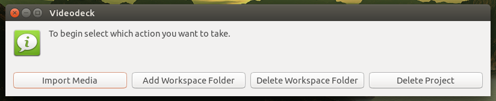

</img>

# Videodeck
A NodeJS/Bash video import system for Linux based systems
<br>
<br>
REQUIRES NODE VERSION 16.15.1 AND ABOVE


[](https://opensource.org/licenses/MIT) 
<br>
<br>
## First Use
Once you have downloaded and un-zipped your files to <b>/home/$USER/Downloads/Videodeck</b>, right click inside the folder to open it in your terminal.
<br>
<br>
Once there run this command:
```bash
$ node service.js
```
This will run the script and shall prompt you with the installation service, once you have gone through the setup you have the choice of creating a desktop shortcut for the app.
<br>
<br>
If you click yes you will see a new icon added, click it then select "Mark as trusted". This will let you run the app from there otherwise you will need to run <b>service.js</b> through the terminal to use it.
<br>
<br>
## How to use?
Video Importer is a GUI for the linux cp and mv command, perfect for RAID Media Servers where you may not have root access to drag and drop files yourself.
<br>
<br>
To use simply open the app from the methods listed above and you will be prompted with 4 options:
</img>
<br>
<br>
From there you will follow the prompts for the selected process.
<br>
<br>
## Open Source

As this project is a Persional project.

However, the following conditions are voided for Videodeck:
> You waive Your rights to any material which you contribute towards the repository, you do not gain any ownership over the repository or material within it nor do you retain any rights to the material which you contributed.

***What can i do with this code?***

You are allowed to use and add-to this code to help make the app better.

***Can I claim what i add as MY code?***

Yes! However you cannot claim my portions as yours and once added I have final say on its being in the project.

***When will this code be updated?***

I will do my best to update the code when i get a full feature made. I will have a folder of test features i'm working on that you can help with.
